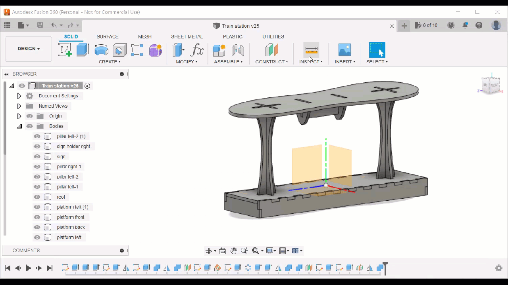

# Flatpack for Autodesk Fusion 360
An addin for Fusion 360 which provides a better way to export DXF and SVG files for laser cutting.

Simple choose Utilities > Make > Export faces to DXF or SVG. The select the faces you want to export and a file name. Optionally, set the accuracy with which curved line segments are converted into straight line segments. Then press OK.

The Flatpack stores the selected faces, accuracy setting and file name in the Fusion 360 document, so it is easy to re-export after the design has been edited.

Holes are given a different color than outer edges in order to make it simple to cut them first.

**This addin comes with no warranty whatsoever. Use at your own risk. See also the [software license](MIT.txt).**

## Building the extension yourself
To install, simply download an installer from the releases. If you prefer to build the addin yourself, do as follows:

Install Visual Studio Community 2022.

Install boost 1.81.0 to "%APPDATA%\Autodesk\Autodesk Fusion 360\API\boost". In order to do this
run the following from a x64 Native Tools Command Prompt for Visual Studio 2022 inside the unzipped boost folder:

    bootstrap.bat
    b2 install --prefix="%APPDATA%\Autodesk\Autodesk Fusion 360\API\boost"

Install WiX:

    dotnet tool install --global wix --version 4.0.0-rc.1

Clone this project recursively to "%APPDATA%\Autodesk\Autodesk Fusion 360\API\AddIns\Flatpackdev".

To build an installer, first build the Flatpack project in Visual Studio, the execute the following in a command line inside the Flatpackinstaller directory:

    wix build FlatpackInstaller.wxs
